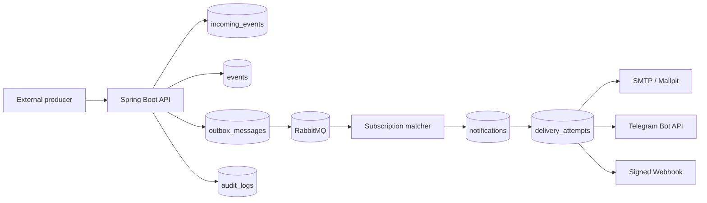

# Notification Subscription Platform

Production-grade event-driven notification backend built with Java 17, Spring Boot, PostgreSQL, RabbitMQ, JWT security, Prometheus/Grafana, Zipkin tracing, and an ELK logging stack.

The platform accepts external events, deduplicates them by producer event id, matches rule-based subscriptions, creates notifications, and delivers them through Email, Telegram, or signed Webhook channels with retry, exponential backoff, delivery attempts, manual requeue, DLQ, metrics, tracing, structured logs, RBAC, audit log, and local Docker infrastructure.

## What This Project Demonstrates

- Idempotent event ingestion with database-level duplicate protection.
- Transactional outbox for reliable RabbitMQ publication.
- Delivery lifecycle: `PENDING`, `QUEUED`, `SENDING`, `SENT`, `RETRY_SCHEDULED`, `FAILED`, `DEAD_LETTERED`.
- Retry with exponential backoff and a dead-letter flow.
- Real channel adapters: SMTP, Telegram Bot API, signed Webhook POST.
- JSON rule DSL with payload-path matching.
- User notification preferences: allowed channels, preferred channel, quiet hours, digest mode.
- JWT RBAC for `USER`, `OPERATOR`, and `ADMIN`.
- Audit logging for subscription, preferences, retry, and denied access workflows.
- Micrometer metrics, Zipkin tracing, correlation IDs, and structured JSON logs.
- Local stack with PostgreSQL, RabbitMQ, Prometheus, Grafana, Zipkin, Elasticsearch, Logstash, Kibana, and Mailpit.

## Architecture Preview



## Quick Start

```bash
cp .env.example .env
docker compose up --build
```

Local URLs:

- App / demo dashboard: `http://localhost:8080`
- Actuator health: `http://localhost:8080/actuator/health`
- Prometheus scrape: `http://localhost:8080/actuator/prometheus`
- RabbitMQ management: `http://localhost:15672` (`guest/guest`)
- Prometheus: `http://localhost:9090`
- Grafana: `http://localhost:3000`
- Zipkin: `http://localhost:9411`
- Mailpit: `http://localhost:8025`
- Elasticsearch: `http://localhost:9200`
- Kibana: `http://localhost:5601`

## Demo Auth

```bash
curl -sS -X POST http://localhost:8080/auth/login \
  -H 'Content-Type: application/json' \
  -d '{"username":"operator","password":"operator"}'
```

Demo users:

- `user/user` -> `ROLE_USER`
- `operator/operator` -> `ROLE_OPERATOR`
- `admin/admin` -> `ROLE_ADMIN`

Pass the token as `Authorization: Bearer <token>`.

## Sample Flow

Create a user and subscription, then publish an idempotent event:

```bash
curl -X POST http://localhost:8080/api/events \
  -H 'Content-Type: application/json' \
  -H 'X-Correlation-Id: demo-correlation-1' \
  -d '{
    "externalEventId": "billing-evt-1001",
    "producer": "billing",
    "type": "SYSTEM_MESSAGE",
    "source": "billing-api",
    "payload": "{\"severity\":\"CRITICAL\",\"service\":\"billing\",\"order\":{\"amount\":120}}"
  }'
```

Sending the same `producer + externalEventId` again returns `200 OK` with `"duplicate": true`; no extra notification is created and `events.duplicate.total` increments.

## Core APIs

- `POST /api/events` - ingest an external event.
- `POST /api/subscriptions` - create a subscription with optional `conditionJson`.
- `GET /api/users/{userId}/subscriptions` - list user subscriptions.
- `GET /api/users/{userId}/notifications` - notification history.
- `GET /api/v1/users/{userId}/preferences` - view preferences.
- `PUT /api/v1/users/{userId}/preferences` - update quiet hours, digest, channels.
- `GET /api/v1/deliveries/{id}` - delivery state for operators.
- `GET /api/v1/deliveries/{id}/attempts` - delivery attempt history.
- `POST /api/v1/deliveries/{id}/retry` - manual retry/requeue.
- `GET /api/v1/admin/dead-letter` - DLQ view.

## Observability

Important metrics:

- `events.accepted.total`, `events.duplicate.total`
- `notifications.created.total`
- `deliveries.sent.total`, `deliveries.failed.total`, `deliveries.retry.total`, `deliveries.deadletter.total`
- `delivery.latency`
- `webhook.delivery.status`
- `outbox.pending.count`
- `subscriptions.matched.total`
- `rule.evaluation.duration`

Every HTTP request gets `X-Correlation-Id` and `X-Request-Id`. The correlation id is propagated through RabbitMQ messages, delivery attempts, audit events, and structured JSON logs.

## Centralized Logging

The app writes JSON logs to `/var/log/notification-platform/notification-platform.json`. Logstash reads that file and indexes documents into Elasticsearch as:

```text
notification-platform-logs-YYYY.MM.DD
```

Useful Kibana queries:

```text
correlationId : "demo-correlation-1"
message : "Duplicate incoming event detected"
message : "Delivery retry scheduled"
message : "moved to terminal delivery state"
message : "Outbox publication failed"
message : "RBAC denied"
```

## Documentation

- [Architecture](docs/architecture.md)
- [Event processing](docs/event-processing.md)
- [Delivery lifecycle](docs/delivery-lifecycle.md)
- [Rule engine](docs/rule-engine.md)
- [Channels](docs/channels.md)
- [Security](docs/security.md)
- [Observability](docs/observability.md)
- [Logging](docs/logging.md)
- [Operations](docs/operations.md)
- [Testing](docs/testing.md)
- [Data model](docs/data-model.md)
- [Architecture decisions](docs/decisions)

## Testing

```bash
mvn test
```

The default test suite uses focused unit and JPA tests that run without Docker. A manual Testcontainers smoke test for PostgreSQL and RabbitMQ is included and documented in [docs/testing.md](docs/testing.md).

## Resume-Worthy Highlights

This repository demonstrates backend maturity beyond CRUD: exactly-once-style ingestion semantics, transactional outbox, retry/DLQ operations, external channel integration, RBAC, auditability, production observability, structured logging, and local infrastructure that mirrors a real notification platform.
