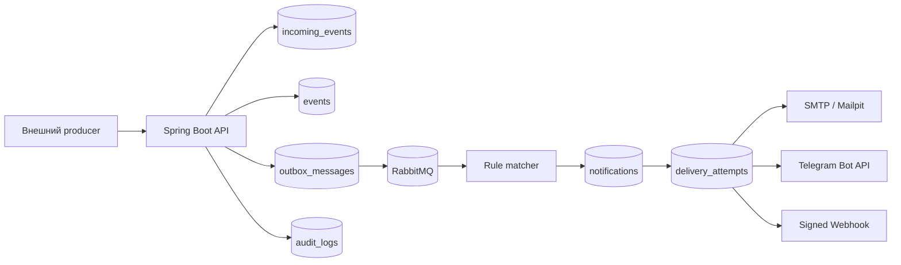

<h1 align="center">Notification Subscription Platform</h1>

<p align="center">
  
</p>

Production-grade backend-платформа уведомлений на Java 17 и Spring Boot: приём событий, идемпотентная обработка, rule-based subscriptions, надёжная доставка по каналам, retry/DLQ, аудит, метрики, tracing и централизованное логирование через ELK.

Платформа принимает внешние события, дедуплицирует их по `producer + externalEventId`, выбирает подписки по JSON-правилам, создаёт уведомления и доставляет их через Email, Telegram или подписанный Webhook. В проекте есть transactional outbox, exponential backoff, история delivery attempts, ручной requeue, RBAC, audit log и полноценная локальная инфраструктура через Docker Compose.

<h2 align="center">Что демонстрирует проект</h2>

- Идемпотентный приём событий с защитой от дублей на уровне БД.
- Transactional outbox для надёжной публикации сообщений в RabbitMQ.
- Жизненный цикл доставки: `PENDING`, `QUEUED`, `SENDING`, `SENT`, `RETRY_SCHEDULED`, `FAILED`, `DEAD_LETTERED`.
- Retry с exponential backoff и dead-letter flow.
- Реальные channel adapters: SMTP, Telegram Bot API, подписанный Webhook POST.
- JSON rule DSL с path-based доступом к payload.
- Пользовательские настройки уведомлений: allowed channels, preferred channel, quiet hours, digest mode.
- JWT RBAC для ролей `USER`, `OPERATOR`, `ADMIN`.
- Audit log для подписок, preferences, retry/requeue и отказов доступа.
- Micrometer metrics, Zipkin tracing, correlation ID и структурированные JSON-логи.
- Локальный стек: PostgreSQL, RabbitMQ, Prometheus, Grafana, Zipkin, Elasticsearch, Logstash, Kibana и Mailpit.

<h2 align="center">Архитектура</h2>



<h2 align="center">Быстрый старт</h2>

```bash
cp .env.example .env
docker compose up --build
```

Локальные адреса:

- Приложение / demo dashboard: `http://localhost:8080`
- Actuator health: `http://localhost:8080/actuator/health`
- Prometheus scrape: `http://localhost:8080/actuator/prometheus`
- RabbitMQ management: `http://localhost:15672` (`guest/guest`)
- Prometheus: `http://localhost:9090`
- Grafana: `http://localhost:3000`
- Zipkin: `http://localhost:9411`
- Mailpit: `http://localhost:8025`
- Elasticsearch: `http://localhost:9200`
- Kibana: `http://localhost:5601`

<h2 align="center">Демо-аутентификация</h2>

```bash
curl -sS -X POST http://localhost:8080/auth/login \
  -H 'Content-Type: application/json' \
  -d '{"username":"operator","password":"operator"}'
```

Демо-пользователи:

- `user/user` -> `ROLE_USER`
- `operator/operator` -> `ROLE_OPERATOR`
- `admin/admin` -> `ROLE_ADMIN`

JWT передаётся в заголовке `Authorization: Bearer <token>`.

<h2 align="center">Пример сценария</h2>

Создать пользователя и подписку, затем опубликовать идемпотентное событие:

```bash
curl -X POST http://localhost:8080/api/events \
  -H 'Content-Type: application/json' \
  -H 'X-Correlation-Id: demo-correlation-1' \
  -d '{
    "externalEventId": "billing-evt-1001",
    "producer": "billing",
    "type": "SYSTEM_MESSAGE",
    "source": "billing-api",
    "payload": "{\"severity\":\"CRITICAL\",\"service\":\"billing\",\"order\":{\"amount\":120}}"
  }'
```

Повторная отправка того же `producer + externalEventId` вернёт `200 OK` с `"duplicate": true`; повторное уведомление не создаётся, а метрика `events.duplicate.total` увеличивается.

<h2 align="center">Основные API</h2>

- `POST /api/events` - принять внешнее событие.
- `POST /api/subscriptions` - создать подписку с опциональным `conditionJson`.
- `GET /api/users/{userId}/subscriptions` - список подписок пользователя.
- `GET /api/users/{userId}/notifications` - история уведомлений пользователя.
- `GET /api/v1/users/{userId}/preferences` - просмотр preferences.
- `PUT /api/v1/users/{userId}/preferences` - обновление quiet hours, digest и каналов.
- `GET /api/v1/deliveries/{id}` - состояние доставки для operator/admin.
- `GET /api/v1/deliveries/{id}/attempts` - история попыток доставки.
- `POST /api/v1/deliveries/{id}/retry` - ручной retry/requeue.
- `GET /api/v1/admin/dead-letter` - просмотр DLQ.

<h2 align="center">Наблюдаемость</h2>

Ключевые метрики:

- `events.accepted.total`, `events.duplicate.total`
- `notifications.created.total`
- `deliveries.sent.total`, `deliveries.failed.total`, `deliveries.retry.total`, `deliveries.deadletter.total`
- `delivery.latency`
- `webhook.delivery.status`
- `outbox.pending.count`
- `subscriptions.matched.total`
- `rule.evaluation.duration`

Каждый HTTP-запрос получает `X-Correlation-Id` и `X-Request-Id`. Correlation ID пробрасывается через RabbitMQ, delivery attempts, audit events и структурированные JSON-логи.

<h2 align="center">Централизованное логирование</h2>

Приложение пишет JSON-логи в `/var/log/notification-platform/notification-platform.json`. Logstash читает файл и индексирует документы в Elasticsearch:

```text
notification-platform-logs-YYYY.MM.DD
```

Полезные KQL-запросы для Kibana:

```text
correlationId : "demo-correlation-1"
message : "Duplicate incoming event detected"
message : "Delivery retry scheduled"
message : "moved to terminal delivery state"
message : "Outbox publication failed"
message : "RBAC denied"
```

<h2 align="center">Документация</h2>

- [Архитектура](docs/architecture.md)
- [Обработка событий](docs/event-processing.md)
- [Жизненный цикл доставки](docs/delivery-lifecycle.md)
- [Rule engine](docs/rule-engine.md)
- [Каналы доставки](docs/channels.md)
- [Безопасность](docs/security.md)
- [Наблюдаемость](docs/observability.md)
- [Логирование](docs/logging.md)
- [Эксплуатация](docs/operations.md)
- [Тестирование](docs/testing.md)
- [Модель данных](docs/data-model.md)
- [Architecture decisions](docs/decisions)

<h2 align="center">Тестирование</h2>

```bash
mvn test
```

Основной test suite использует focused unit и JPA-тесты, которые запускаются без Docker. В проект добавлен manual Testcontainers smoke test для PostgreSQL и RabbitMQ; он описан в [docs/testing.md](docs/testing.md).

<h2 align="center">Почему проект выглядит сильным для резюме</h2>

Репозиторий демонстрирует зрелость backend-разработки за пределами CRUD: идемпотентность, transactional outbox, retry/DLQ operations, внешние каналы доставки, RBAC, auditability, production observability, structured logging и локальную инфраструктуру, близкую к реальной notification platform.
