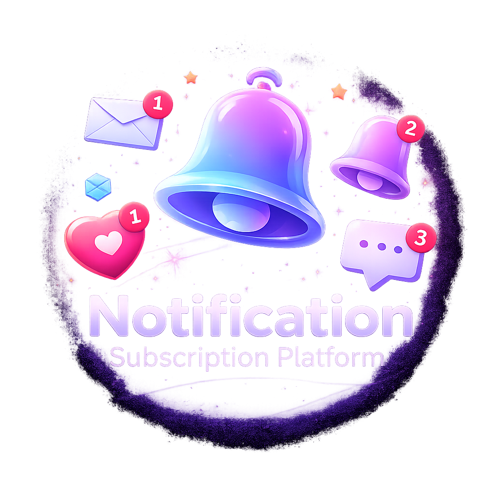
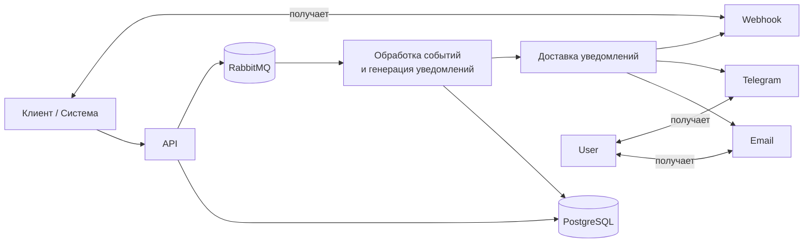

# Notification Subscription Platform

<p align="center">
  
</p>

## Обзор проекта
Платформа уведомлений, построенная вокруг событий. Приложение принимает события от внешних систем, сохраняет их, генерирует уведомления по активным подпискам и доставляет их через несколько каналов: `email`, `webhook`, `telegram`.

API в проекте намеренно тонкий: HTTP-слой отвечает за приём и валидацию запросов, а основная бизнес-логика сосредоточена в сервисах и потребителях сообщений.

## Архитектура
Система разделена на несколько слоёв:
- `api`: REST-контроллеры, DTO, мапперы и обработка ошибок
- `application`: use case-сервисы и orchestration-логика
- `domain`: сущности, перечисления и доменные правила
- `infrastructure`: persistence, messaging, security, metrics и внешние интеграции

Ключевые инфраструктурные компоненты:
- PostgreSQL: хранение пользователей, событий, подписок и уведомлений
- RabbitMQ: шина событий и очереди доставки
- Micrometer + Prometheus + Grafana: метрики и визуализация
- Zipkin: distributed tracing

## Поток обработки событий
```text
Клиент
  | POST /api/events
  v
EventService -> PostgreSQL (events)
  |
  | publish event.occurred
  v
RabbitMQ
  |
  v
EventConsumer -> NotificationGeneratorService -> PostgreSQL (notifications)
  |
  | enqueue delivery request
  v
RabbitMQ (delivery queue)
  |
  v
DeliveryConsumer -> NotificationDeliveryService -> Channel sender (email/webhook/telegram)
```

## Архитектурная диаграмма



## Технологический стек
- Java 17
- Spring Boot 3
- Spring Data JPA, Flyway
- PostgreSQL 16
- RabbitMQ 3
- Micrometer, Prometheus, Grafana
- Zipkin
- Spring Security + JWT

## Быстрый запуск через Docker Compose
1. Соберите и запустите сервисы:
```bash
docker-compose up --build
```
2. Приложение будет доступно по адресу `http://localhost:8080`
3. Встроенная web-панель: `http://localhost:8080/`
4. RabbitMQ management UI: `http://localhost:15672` (`guest/guest`)
5. Prometheus: `http://localhost:9090`
6. Grafana: `http://localhost:3000`
7. Zipkin: `http://localhost:9411`

## Аутентификация
Демо-эндпоинт:
- `POST /auth/login`

Демо-учётные данные:
- `{"username":"user","password":"user"}`
- `{"username":"admin","password":"admin"}`

В ответе сервис возвращает JWT-токен, который нужно передавать в `Authorization: Bearer <token>`.

## Основные API-эндпоинты
- `POST /api/events`: публикация события
- `POST /api/subscriptions`: создание подписки
- `GET /api/users/{userId}/subscriptions`: список подписок пользователя
- `GET /api/users/{userId}/notifications`: список уведомлений пользователя
- `GET /`: встроенная web-панель для ручной проверки API
- `GET /actuator/health`: health-check
- `GET /actuator/prometheus`: метрики в формате Prometheus

## Наблюдаемость
- health endpoint: `GET /actuator/health`
- метрики: `GET /actuator/prometheus`
- таймер времени доставки: `delivery.duration`
- кастомные счётчики: `notifications.sent.count`, `notifications.retry.count`, `notifications.failed.count`

## Подробная документация
Архитектурные детали вынесены в отдельную папку:
- [docs/architecture/README.md](docs/architecture/README.md)

## Возможные улучшения
- Добавить Testcontainers для полноценных интеграционных тестов с Postgres и RabbitMQ
- Добавить идемпотентность на приём событий и на доставку
- Ввести экспоненциальный backoff для retry
- Подключить реальные интеграции каналов: SMTP, Telegram API, Webhook retry
- Добавить более детальную RBAC-модель и audit logging
