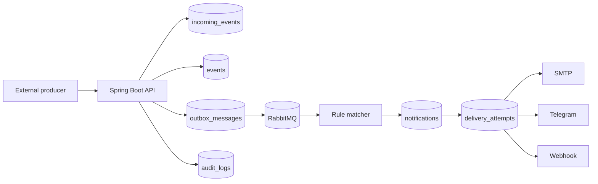
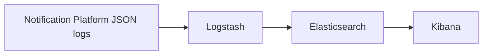

# Architecture

Notification Subscription Platform is split into API, application, domain, and infrastructure layers.

## Components

- Spring Boot API receives external events, subscriptions, preferences, and operator commands.
- PostgreSQL stores incoming event registry, app events, subscriptions, notifications, delivery attempts, outbox messages, preferences, digest items, and audit logs.
- RabbitMQ moves event and delivery work out of HTTP requests.
- Transactional outbox closes the gap between database commits and RabbitMQ publication.
- Channel adapters deliver Email, Telegram, and signed Webhook notifications.
- Prometheus/Grafana, Zipkin, and ELK provide metrics, traces, and logs.

## RabbitMQ Flow

- `app.events` exchange routes `event.occurred` to `events.queue`.
- `delivery` queue contains delivery jobs.
- `delivery.retry` delays retries by message expiration and dead-letters back to `delivery`.
- `delivery.dlq` stores terminal failure messages for operator inspection.

## Centralized Logging Flow

