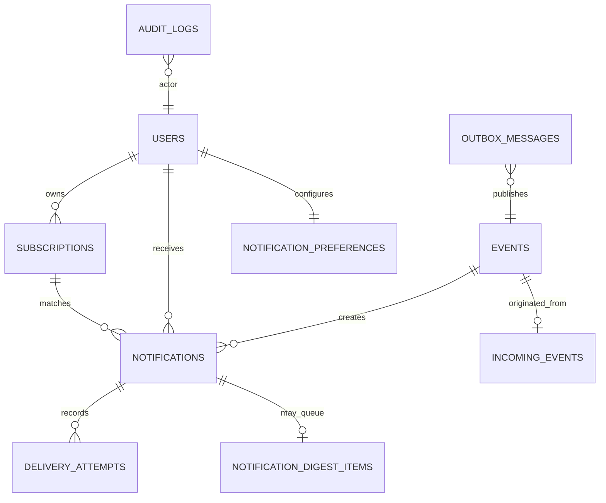

# Data Model

Main tables:

- `incoming_events`: producer idempotency registry.
- `events`: normalized internal event record.
- `subscriptions`: event type, channel, destination, optional `condition_json`.
- `notifications`: delivery state and user-facing history.
- `delivery_attempts`: per-attempt channel diagnostics.
- `outbox_messages`: transactional publication queue.
- `notification_preferences`: channel, quiet hours, digest settings.
- `notification_digest_items`: queued digest records.
- `audit_logs`: administrative and security-sensitive events.
