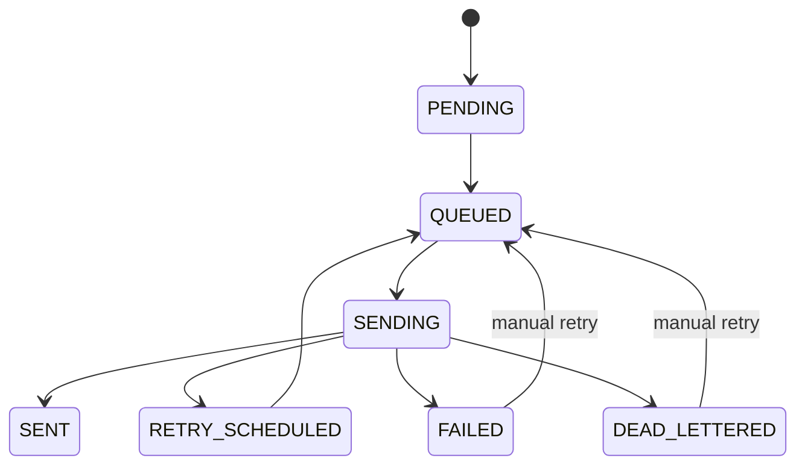

# Delivery Lifecycle

Deliveries are represented by notifications plus `delivery_attempts`.

## Retry Policy

Retryable failures use exponential backoff: `5s`, `10s`, `20s`, `40s`, capped at `300s`. Retries are carried by `delivery.retry`, which dead-letters back to `delivery` after message expiration.

## Transient vs Permanent Failures

- Network failures and 5xx responses are retryable.
- Explicit channel configuration errors and webhook/Telegram 4xx responses are permanent.
- Retryable failures that exceed the max retry count transition to `DEAD_LETTERED`.
- Permanent failures transition to `FAILED`.

Operators can inspect `GET /api/v1/deliveries/{id}/attempts`, inspect `GET /api/v1/admin/dead-letter`, and requeue with `POST /api/v1/deliveries/{id}/retry`.
