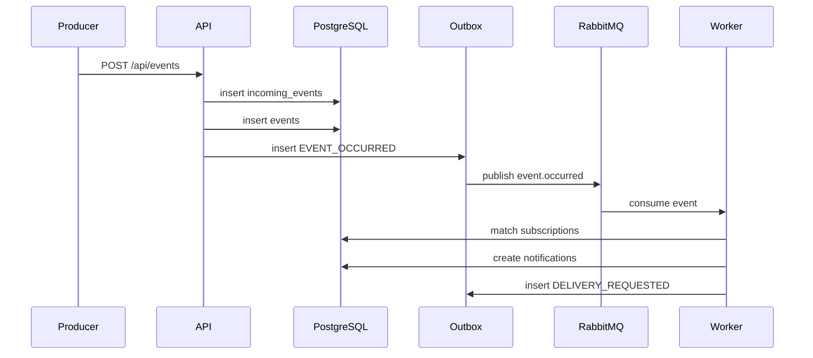

# Event Processing

`POST /api/events` accepts an event with `externalEventId`, `producer`, `type`, `source`, and JSON `payload`.

The pair `producer + externalEventId` is unique in `incoming_events`. If the same event is submitted again, the service returns a duplicate response, does not create another app event or notification, and increments `events.duplicate.total`.

Rule matching only runs after event deduplication. Invalid subscription rules evaluate to `false`, so malformed conditions do not break event processing.
