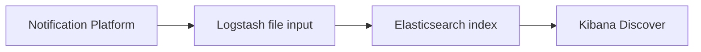
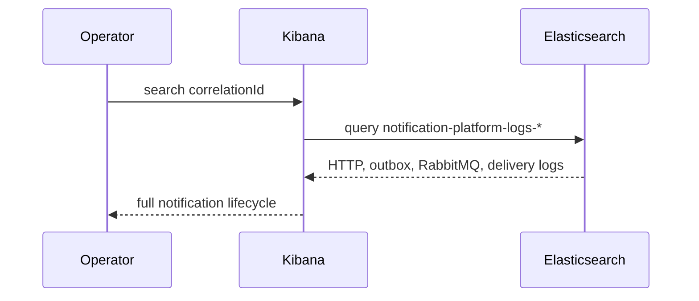

# Centralized Logging

The app writes structured JSON logs through `logback-spring.xml`. Docker Compose mounts the app log volume into Logstash.



Index pattern:

```text
notification-platform-logs-YYYY.MM.DD
```

Log fields include `timestamp`, `level`, `logger`, `message`, `requestId`, `correlationId`, `notificationId`, `deliveryId`, `channel`, `retryAttempt`, and `actorUserId` when available through MDC/structured arguments.

## Kibana Use Cases

Duplicate event:

```text
message : "Duplicate incoming event detected"
```

Trace notification flow:

```text
correlationId : "demo-correlation-1"
```

Retry storm:

```text
message : "Delivery retry scheduled"
```

Dead-letter transition:

```text
message : "moved to terminal delivery state"
```

Webhook failure:

```text
message : "Webhook" OR code : "WEBHOOK_5XX"
```

Outbox failure:

```text
message : "Outbox publication failed"
```

RBAC denial:

```text
message : "RBAC denied"
```


